## Using AWS CodePipelines

Scanning an application with Veracode involves configuring a CodePipeline to perform the required CodeBuild steps.  

For this pipeline we will use a single repo for the AWS pipeline configurations and a second repo for our code base. This way we can manage the code repos externally. 

This is outlined below.

## Setup

### Clone repos

Clone this aws_default_pipelines repository in your repository manager of choice (GitHub, GitLab, BitBucket). 
Clone and additional source code repository (In this example we will use: https://github.com/veracode-demo-labs/verademo-java).

### Configure Docker login and Veracode credentials in the Secrets Manager

DockerHub has limited pull requests for non-authenticated users.  In order to avoid hitting these limits, we'll configure our DockerHub login credentials in the AWS Secrets Manager.  

Create a new Secret in the AWS Secrets Manager - let's call it "dockerhub".  Add the following two key/value pairs to this secret:

* key = `username`, value = your DockerHub username
* key = `password`, value = your DockerHub password

Create a new Secret in the AWS Secrets Manager - let's call it "veracode".  Add the following two key/value pairs to this secret:
* key = `veracode_api_key_id`, value = your Veracode API Key
* key = `veracode_api_key_secret`, value = your Veracode API Secret
* key = `veracode_sca_agent_token`, value = your Veracode SCA Agent token

## CodePipeline

We will create a CodePipeline to perform the following CodeBuild jobs:

* Build the application using Veracode's docker packaging image: https://hub.docker.com/r/veracode/scm-packaging
* Do the Veracode static scan
* (optional) Do the Veracode SCA scan
* (optional) Do the Veracode Container scan

This is an overview of the Pipeline we'll be creating:

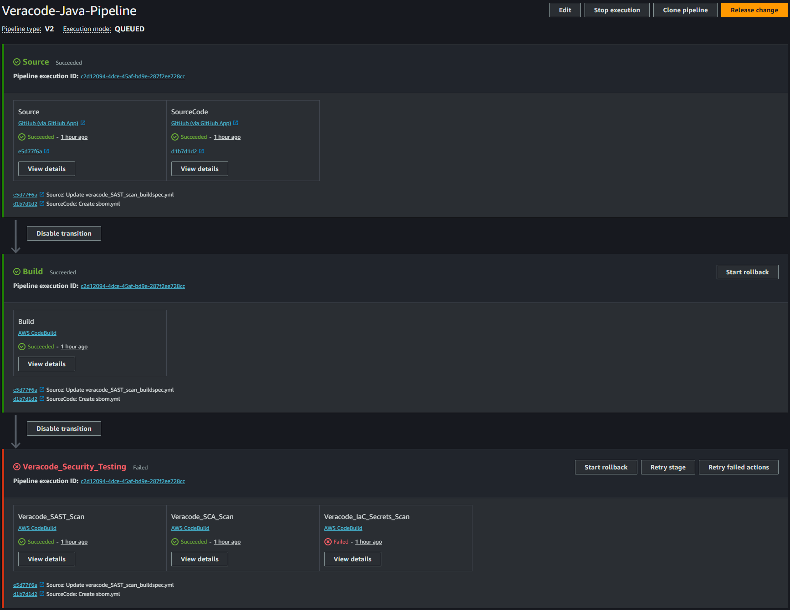 

### Create the Pipeline to Build the application

Create a CodePipeline with the following settings (take the defaults unless otherwise specified):

* Source: your GitHub repo
	* Source 1: GitHub aws_default_pipelines repository
		* Branch: main
		* Output artifact format: Full clone
		* 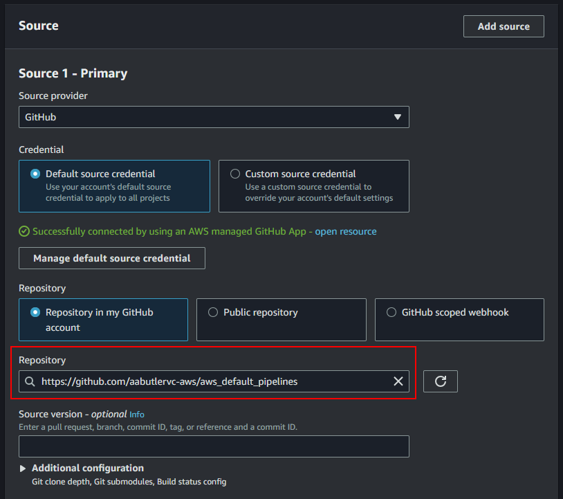 
	* Source 2: GitHub source code repository
		* Branch: main
		* Output artifact format: Full clone
		* 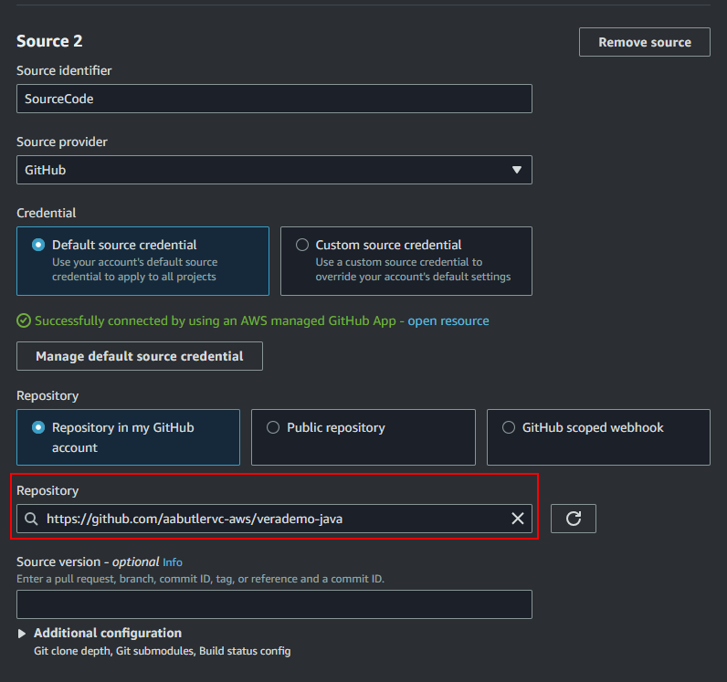 
* Build: AWS CodeBuild, create a project with the following settings:
	* Source 1: GitHub aws_default_pipelines repository
		* Branch: main
		*  
	* Source 2: GitHub source code repository
		* Branch: main
		*  
	* Environment: Custom image
		* Environment type: Linux EC2
		* Other registry
		* External registry URL: veracode/scm-packaging:3.0.0 
			* Version number may need changing to match latest pushed image. 
		* Registry credentials: the name or ARN of your DockerHub credentials from the AWS Secrets Manager
		* 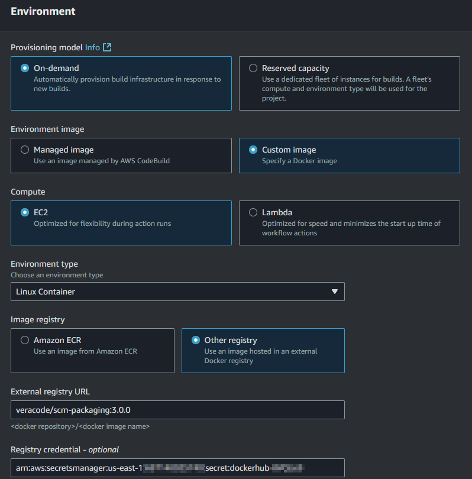 
		* Service role as required to build (likely the default is OK)
			* Note: you might need to add permission for the Service Role to read the Secrets Manager.  There is a pre-defined "SecretsManagerReadWrite" role which can be used, although this is too permissive for real-world use.  Alternately, a read-only permission can be created and used.
	* Buildspec: use a Buildspec file (the existing `veracode_pakcage_buildspec.yml` file in the repo will be used by default)
		* 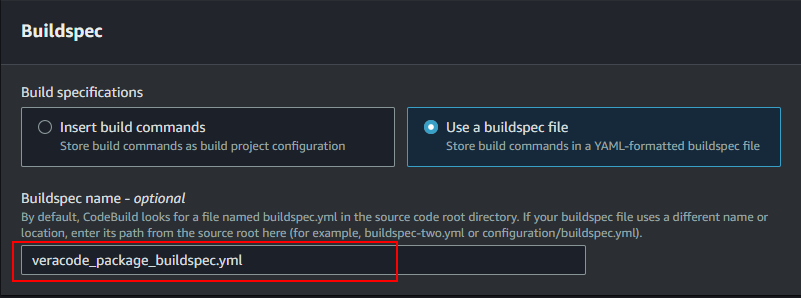 
	* Artifacts: upload to the S3 bucket associated with the CodePipeline
		* Packaging: None
* Deploy: Skip this stage

Here is a summary of the CodeBuild configuration:

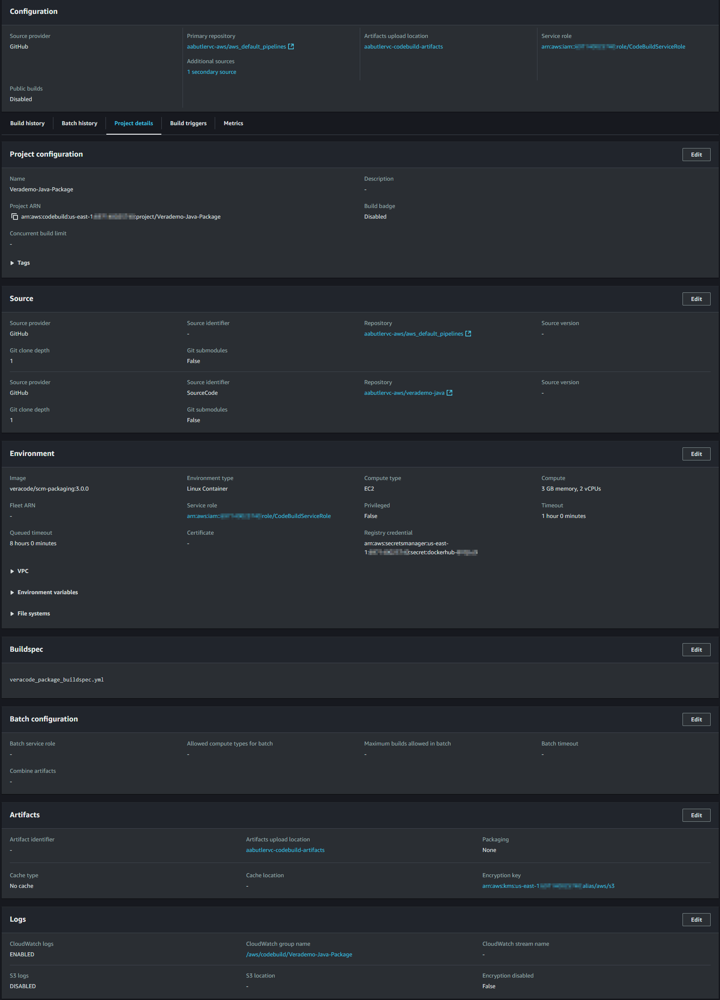

Run and test the CodePipeline.  The app should build and the `verademo.war` and two other zip files should be placed in the specified S3 bucket.
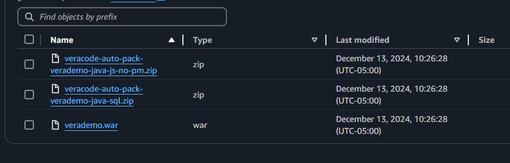

### Add the Veracode static scan Action

Edit your CodePipeline and add a stage called "Veracode_Security_Testing"

Edit this Security stage and add an Action called "Veracode_SAST_Scan"

* Action name = "Veracode_SAST_Scan"
* Action provider = AWS CodeBuild, create a project with the following settings:
	* Source 1: GitHub aws_default_pipelines repository (for the veracode_SAST_scan_buildspec.yml)
	* Source 2: the artifacts (verademo.war and zip files) from the S3 bucket
	* Environment: Custom image
		* Environment type: Linux EC2
		* Other registry
		* External registry URL: veracode/api-wrapper-java
		* Registry credentials: the name or ARN of your DockerHub credentials from the AWS Secrets Manager
		* Service role as required to build (likely the default is OK)
			* Note: you might need to add permission for the Service Role to read the Secrets Manager.  There is a pre-defined "SecretsManagerReadWrite" role which can be used, although this is too permissive for real-world use.  Alternately, a read-only permission can be created and used.
		* Environment variables, add the following:
			* BranchName
				* Name: BranchName
				* Value: #{SourceCodeVariables.BranchName}
			* CommitId
				* Name: CommitId
				* Value: #{SourceCodeVariables.CommitId}
			* RepoName
				* Name: RepoName
				* Value: #{SourceCodeVariables.FullRepositoryName}
			* 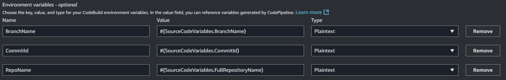 
	* Buildspec: Insert build commands
		* Easy way is to switch to 'edit mode', delete the existing template, and paste the build commands from this repo's `veracode_SAST_scan_buildspec.yml` file
	* Artifacts: None

Here is a summary of the CodeBuild configuration:

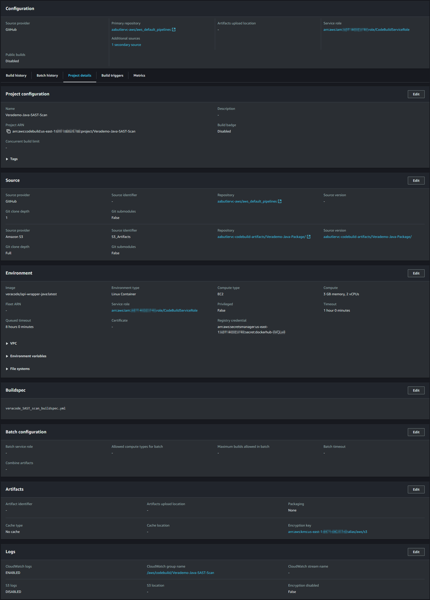

Run and test the CodePipeline.  The verademo.war and zip files should be uploaded to Veracode and a static scan initiated.	

### Add the Veracode SCA scan Action

Edit the Security stage and add an Action called "Veracode_SCA_Scan"

* Action name = "Veracode_SCA_Scan"
* Action provider = AWS CodeBuild, create a project with the following settings:
	* Source 1: GitHub aws_default_pipelines repository (for the veracode_SCA_scan_buildspec.yml)
	* Source 2: GitHub Source Code repo
	* Environment: Custom image
		* Environment type: Linux EC2
		* Other registry
		* External registry URL: veracode/scm-packaging:3.0.0 
			* Version number may need changing to match latest pushed image. 
		* Registry credentials: the name or ARN of your DockerHub credentials from the AWS Secrets Manager
	* Buildspec: Insert build commands
		* Easy way is to switch to 'edit mode', delete the existing template, and paste the build commands from this repo's `veracode_SCA_scan_buildspec.yml` file
	* Artifacts: None

Here is a summary of the CodeBuild configuration:

Run and test the CodePipeline.  

### Add the Veracode container scan Action

Edit the Security stage and add an Action called "Veracode_IaC_Secrets_Scan"

* Action name = "Veracode_IaC_Secrets_Scan"
* Action provider = AWS CodeBuild, create a project with the following settings:
	* Source 1: GitHub aws_default_pipelines repository (for the veracode_iac_secrets_scan_buildspec.yml)
	* Source 2: GitHub Source Code repo
	* Environment: Custom image
		* Environment type: Linux EC2
		* Other registry
		* External registry URL: veracode/scm-packaging:3.0.0 
			* Version number may need changing to match latest pushed image. 
		* Registry credentials: the name or ARN of your DockerHub credentials from the AWS Secrets Manager
	* Buildspec: Insert build commands
		* Easy way is to switch to 'edit mode', delete the existing template, and paste the build commands from this repo's `veracode_iac_secrets_scan_buildspec.yml` file
	* Artifacts: None

Here is a summary of the CodeBuild configuration:

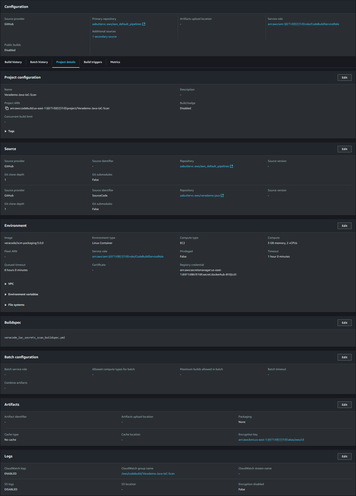

Run and test the CodePipeline. 

### Edit the CodePipeline

Edit the triggers and disable the source trigger from the aws_default_pipelines repo. This will ensure that the pipeline only runs when changes are made to the source code repo (in this example Verademo-Java) and not the pipeline repo.

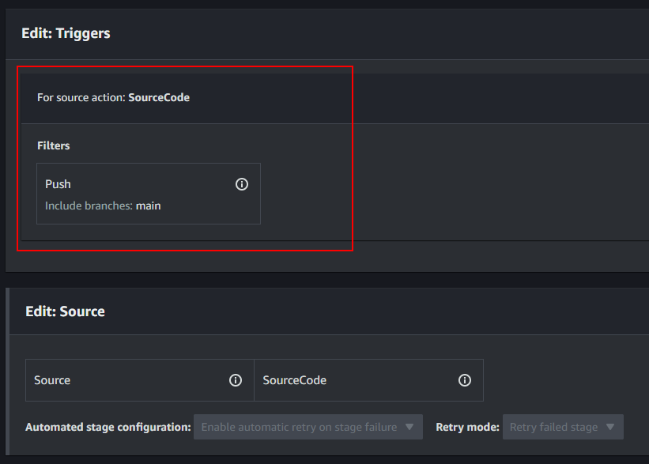